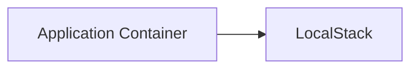

# LocalStack docker debug image

This repository contains the source code for the LocalStack docker debug application.

## Usage

If you have an issue with your docker networking setup, you can use this docker container to investigate further.
The tool has multiple usage modes.

### Diagnose

In this mode, the tool will replicate attempting to connect from your application container to your target container.




The general usage of this mode is to run

```bash
docker run --rm \
    -v /var/run/docker.sock:/var/run/socker.sock \
    ghcr.io/simonrw/localstack-docker-debug:main \
        diagnose \
        --source-container "Application Container" \
        --target-container "LocalStack"
```

This attempts to diagnose the connectivity issues between your application container and target container by temporarily adjusting docker user-defined networks.

It will output suggestions on what changes to make to the command line.

If the `--localstack` flag is supplied, or the `--target-container` flag is not supplied, we assume the target container is LocalStack, and verify connectivity by making a request to the [health endpoint](https://docs.localstack.cloud/references/internal-endpoints/#localstack-endpoints).

### Probe

This mode scans your docker network for network specific information about the containers you are currently running, and outputs a JSON log file to stdout.

```bash
docker run --rm \
    -v /var/run/docker.sock:/var/run/socker.sock \
    ghcr.io/simonrw/localstack-docker-debug:main \
        probe
```

This command collects:

* networks:
    * id
    * name
    * subnet
    * gateway
    * containers:
        * id
        * name
        * image
        * labels
        * status
        * interfaces:
            * network name
            * gateway
            * ip address


## LocalStack team usage

This tool can be installed as a pip package, and gives access to an additional command: `render`.
This command renders the output of the `probe` command to a graphviz dot files:

```bash
python -m dockerdebug render -f <output.json> > output.dot
dot -Tpng -o output.png output.dot
open output.png
```

### Package installation

1. Install `dot` (graphviz)
2. `pip install -e .`

## Security

We mount the docker socket because we have to be able to run docker commands.
If you have concerns about what this tool does, the source code is available in this repo.

## Contributing

TODO
